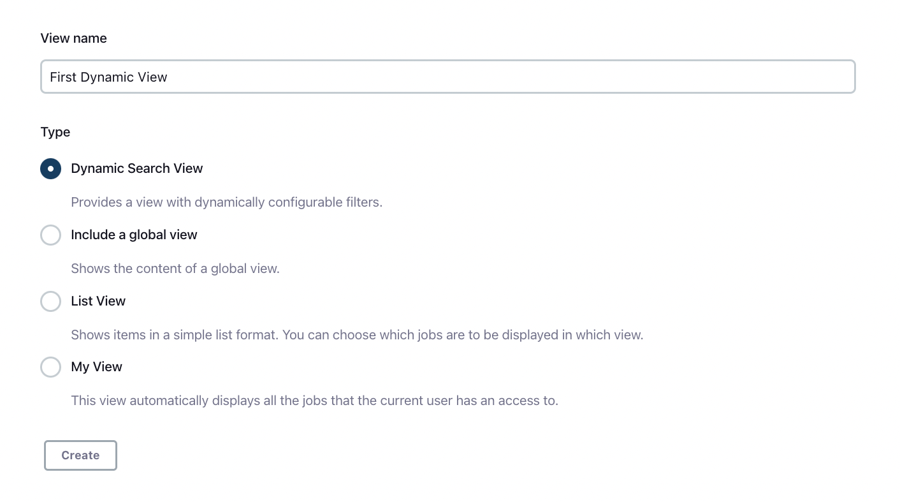
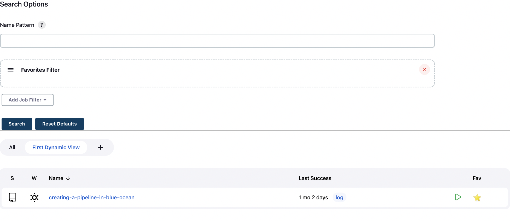

The Dynamic Search View plugin adds a new view option, which allows you to configure additional filters on top of your main view.

# About this plugin

The Dynamic Search View allows you to configure additional filters at the view’s main page, which are applied after selecting **Submit**.
This allows users to filter and search for jobs in one central view.

**WARNING** 

The current version of the plugin is a proof of concept and has several significant issues, which are listed here. 
They will be fixed in future versions.
As always, contributions are appreciated by anyone!

# Usage

1.  Create a new **Dynamic Search View**.
2.  Configure the main filters for the view.
  a. You can setup implicit filters and columns.
  b. The plugin also supports standard `JobFilter` and `ListViewColumn` extensions.
  c. If you want to filter all jobs, set a regexp filter with the `.\*` mask
3.  Select your new view.
  a.  You can set additional filters on the main view page.
  b.  Select **Submit** to apply the additional filters.

The updated View creation page:

View with additional filters:

